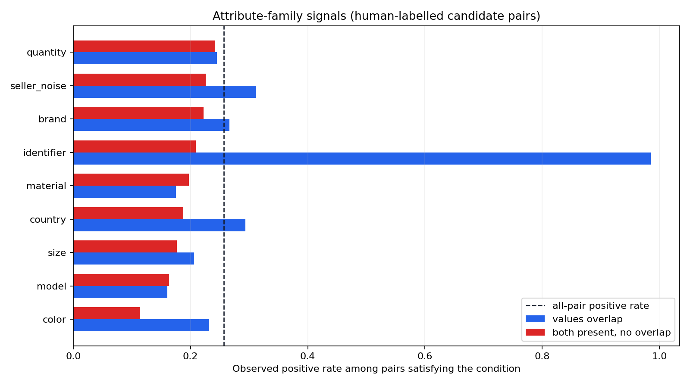

# Отчёт по атрибутам товаров

Отчёт основан на `notebooks/02_attributes_analysis.ipynb` и описывает только
результаты анализа поля `attributes` на ручной разметке. Полные таблицы лежат в
`reports/attributes_analysis/`.

## Главное о данных

- Проанализировано 711 304 товара и 365 654 размеченные пары.
- В `attributes` найдено 33 990 разных ключей.
- У одного товара медианно 11 непустых атрибутов.
- Все значения `attributes` корректно разбираются как JSON-объекты.

Из-за 33 990 ключей нельзя строить одну глобальную таблицу «один ключ — один
столбец»: она будет очень разреженной, а одинаковые по смыслу признаки в разных
категориях часто называются по-разному. Атрибуты нужно сравнивать внутри пары и
учитывать категорию товара.

## Что означает positive rate

Для некоторого условия `S` считается:

```text
positive rate = число дублей, удовлетворяющих S / число всех пар, удовлетворяющих S
```

То есть это наблюдаемая доля дублей среди пар с данным условием. Например:

- значения цвета пересекаются: 59 580 пар, из них 23.08% — дубли;
- цвет указан с обеих сторон, но значения не пересекаются: 97 473 пары, из них
  11.31% — дубли.

Это **не корреляция**, не AP модели и не вероятность, которую следует напрямую
писать в submit. Эти доли зависят от категории, пропусков, качества извлечения
значений и от того, как retrieval подобрал пары. Они показывают направление и
потенциальную полезность признака, которую затем нужно проверять на validation.

В примере с цветом особенно полезен конфликт: если цвета явно разные, доля
дублей падает примерно вдвое. При этом само совпадение цвета не доказывает, что
товары одинаковы.



## Важные сигналы

| Семейство | Совпадение | Конфликт | Вывод |
|---|---:|---:|---|
| Идентификатор | 98.51% (67 пар) | 20.88% | Очень сильный, но крайне редкий сигнал |
| Цвет | 23.08% | 11.31% | Явный конфликт — сильный отрицательный сигнал |
| Страна | 29.40% | 18.77% | Полезно сравнивать явно |
| Бренд | 26.67% | 22.21% | Полезен, но одного бренда недостаточно |
| Размер | 20.64% | 17.70% | Умеренный отрицательный сигнал при конфликте |
| Количество | 24.52% | 24.23% | Без нормализации единиц почти не разделяет пары |
| Модель | 16.03% | 16.34% | Текущее выделение семейства не работает |
| Материал | 17.52% | 19.72% | Глобальное правило применять нельзя |

Дополнительные выводы:

- Для модели/SKU простого поиска ключей недостаточно. Нужны токены из значений,
  артикулы и числа из названия.
- Для количества нужны разбор числа и нормализация единиц (`мл`, `л`, `г`, `кг`,
  `шт`), иначе `1 л` и `1000 мл` выглядят как конфликт.
- Материал сильно зависит от категории и качества заполнения. Модель должна
  использовать его вместе с категорией, а не как универсальное правило.
- Поля продавца, магазина, доставки и гарантии связаны с target, но могут быть
  нестабильной особенностью источника данных. Их нужно держать отдельной группой
  и проверять абляцией.
- У категорий есть собственные полезные ключи: например, индекс нагрузки,
  оптическая сила, цвет товара, формат, число отделений и комплектация.
  Выбирать такие ключи можно только по train-части, иначе возникает утечка из
  validation.

## Что используем в эксперименте

Raw JSON целиком в эмбеддер пока не отправляем. Для первого сравнения строятся
компактные pair-features:

1. число общих ключей и Jaccard ключей;
2. число и доля совпавших/конфликтующих значений;
3. состояния `оба заполнены / есть пересечение / есть конфликт` для бренда,
   идентификатора, размера, количества, цвета, материала, страны и шумных полей;
4. несколько лучших точных ключей отдельно для каждой категории, выбранных
   только на train;
5. категория товара.

Это позволяет честно сравнить три модели на одном component-disjoint split:

1. CatBoost только на признаках названий;
2. CatBoost на названиях и `Qwen3-Embedding-0.6B`;
3. CatBoost на названиях, эмбеддингах и структурированных атрибутах.

Эмбеддинг считается один раз на каждый уникальный товар и переиспользуется во
всех его парах. Для первого запуска используются первые 256 Matryoshka-координат
Qwen с повторной L2-нормализацией: это уменьшает память и размер CatBoost-признаков.
