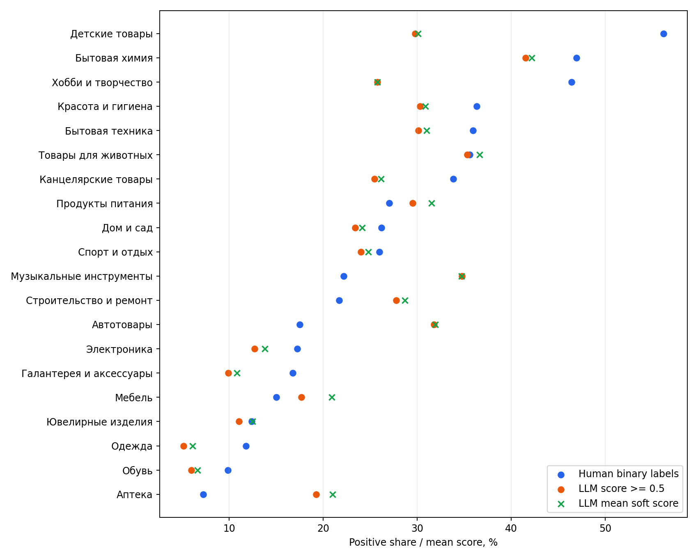

# Распределение 11,19 млн LLM-размеченных пар

Дата расчёта: 14 августа 2026 года. Отчёт сравнивает
`data/matches_llm.parquet` с ручной разметкой `data/matches.parquet` и связывает
результаты с аудитом split и диагностикой class-prior shift.

Воспроизводимый расчёт:

```powershell
python scripts/analyze_llm_distribution.py
```

Компактные артефакты находятся в `reports/llm_label_distribution/`.

## Краткий вывод

1. В LLM-файле 11 187 780 корректных внутрикатегорийных пар. Пропусков,
   self-pairs и повторов неупорядоченных пар нет.
2. `target` — не произвольная непрерывная вероятность, а сетка из десяти
   значений `k/9`. Средний score равен **24,36%**. При диагностической
   бинаризации `target >= 0.5` положительными становятся **23,41%** пар.
3. Глобально это близко к human prevalence **25,68%**, но внутри категорий
   распределения заметно различаются: разница достигает `-26,40` п.п. для
   детских товаров, `-20,63` п.п. для хобби, `+14,32` п.п. для автотоваров и
   `+12,58` п.п. для музыкальных инструментов.
4. Human и LLM используют полностью разные товары. Ни одна LLM-пара не содержит
   human item ID. Поэтому human holdout автоматически чистый, но прямой аудит
   качества LLM-меток по пересечению невозможен.
5. Наблюдаемый в 11M category-prior shift не объясняет leaderboard `~0.21`.
   Перевзвешивание frozen CatBoost с human-validation prevalence на LLM priors
   меняет macro AP с `0.5015` только до `0.4743` (`target >= 0.5`) или `0.4865`
   (средний soft score).
6. Есть признаки covariate shift: на фиксированной category-balanced выборке
   LLM-пары в среднем имеют более низкую лексическую близость названий, чем
   human-пары. Следовательно, 11M — не просто большее количество пар из того же
   распределения.

Главный практический вывод: human-разметка остаётся лучшим источником точной
семантики и чистой финальной validation, но она не даёт надёжной абсолютной
оценки leaderboard. LLM-разметка полезна прежде всего для покрытия другого
item/candidate distribution, а не для исправления глобального class prior.

## Что уже известно о human-разметке

В human-наборе:

- 365 654 пары, из них 93 890 положительных;
- global prevalence `25.677%`, средняя category prevalence `26.111%`;
- category prevalence от `7.26%` до `56.20%`;
- 97,7% товаров встречаются только в одной размеченной паре;
- component-disjoint `HistGradientBoosting` даёт OOF macro AP `0.5351`;
- names-only CatBoost даёт `0.5015`, Qwen embeddings + attributes v1 —
  `0.5748`, attributes v2 — `0.5962` локально;
- submission Qwen embeddings + attributes v1 получил `0.2159` на leaderboard.

Аудит split уже проверил четыре component seeds, exact-name holdout и
brand/model-family holdout. Для одной и той же lexical CatBoost macro AP лежит
в узком диапазоне `0.4982–0.5149`. Это исключает простой leakage по item ID,
точному имени или brand/model family как объяснение падения до `~0.21`, но не
исключает selection/covariate shift между human и скрытыми retrieval-парами.

Существующая prevalence-диагностика показывает, что при неизменном ranking
глобальное снижение effective prevalence до `5.9039%` математически опускает
macro AP с `0.5015` до `0.21`. Это сценарий чувствительности, а не оценка
скрытой prevalence.

## Схема и целостность LLM-набора

| Проверка | Результат |
|---|---:|
| Пары | 11 187 780 |
| Уникальные товары в парах | 12 384 610 |
| Пропуски `id1`, `id2`, `target` | 0 |
| ID, отсутствующие в `items.parquet` | 0 |
| Межкатегорийные пары | 0 |
| Self-pairs | 0 |
| Повторные неупорядоченные пары | 0 |
| Пары с любым human item ID | 0 |

В полном `items.parquet` 13 397 761 уникальный товар. Все 711 304 human-товара
в нём присутствуют, но не участвуют в LLM-парах. Помимо human-товаров и
12 384 610 LLM-товаров остаются 301 847 карточек, не участвующих ни в одной из
двух разметок.

Граф LLM-пар плотнее human-графа:

- средняя степень товара `1.807`;
- 74,31% товаров имеют степень 1 против 97,7% в human;
- медиана степени 1, p90 — 3, p95 — 5, p99 — 12;
- максимальная степень 223.

Это дополнительное свидетельство различия sampling/retrieval: в LLM-наборе
существенно чаще повторяются товарные семейства и одни товары сравниваются с
несколькими кандидатами.

## Распределение LLM target

Фактически присутствуют только значения `k/9`:

| Target | Пар | Доля |
|---:|---:|---:|
| 0 | 7 184 663 | 64,219% |
| 1/9 | 1 434 | 0,013% |
| 2/9 | 632 415 | 5,653% |
| 3/9 | 497 157 | 4,444% |
| 4/9 | 252 544 | 2,257% |
| 5/9 | 269 160 | 2,406% |
| 6/9 | 170 222 | 1,521% |
| 7/9 | 276 349 | 2,470% |
| 8/9 | 679 881 | 6,077% |
| 1 | 1 223 955 | 10,940% |

Основные способы посчитать «долю положительного класса»:

- среднее значение soft target: `24.356%`, или 2 724 903,22 единицы
  положительной массы;
- `target >= 0.5`: 2 619 567 пар, `23.415%`;
- строго `target == 1`: 1 223 955 пар, `10.940%`;
- строго `target == 0`: 7 184 663 пары, `64.219%`;
- промежуточные значения: 2 779 162 пары, `24.841%`.

Среди только точных краёв `0/1` положительных `14.556%`. Пары около границы
`4/9` и `5/9` составляют 4,663% всего набора.

Сетка совместима с долей голосов или агрегированным score девяти решений, но
по одному parquet нельзя установить происхождение или калибровку target.
Особенно необычна почти отсутствующая точка `1/9`. Поэтому далее `>=0.5`
используется только как понятный binary proxy, а не как восстановленная
истинная метка.

## Категории

LLM-пары почти равномерно распределены по 20 категориям: от 515 675 до 596 224
пар на категорию, коэффициент вариации 4,1%. При этом число товаров категории в
`items.parquet` меняется от 339 875 до 1 028 081. Это похоже на специально
сбалансированную выдачу, а не на необработанную долю категорий в production.

`Δ` ниже равна `LLM >= 0.5` минус human positive rate.

| Категория | Human пары | LLM пары | Human +, % | LLM >=0.5, % | LLM mean, % | Δ, п.п. | LLM soft 0<y<1, % |
|:---|---:|---:|---:|---:|---:|---:|---:|
| Автотовары | 19 010 | 593 803 | 17,50 | 31,81 | 31,90 | +14,32 | 17,11 |
| Аптека | 18 285 | 553 908 | 7,26 | 19,28 | 21,03 | +12,02 | 24,38 |
| Бытовая техника | 17 814 | 548 549 | 35,95 | 30,15 | 31,02 | -5,80 | 34,53 |
| Бытовая химия | 17 436 | 517 729 | 46,93 | 41,54 | 42,18 | -5,39 | 32,11 |
| Галантерея и аксессуары | 17 984 | 551 785 | 16,76 | 9,93 | 10,82 | -6,83 | 13,69 |
| Детские товары | 17 561 | 559 016 | 56,20 | 29,80 | 30,07 | -26,40 | 28,08 |
| Дом и сад | 17 574 | 572 845 | 26,22 | 23,40 | 24,15 | -2,82 | 25,69 |
| Канцелярские товары | 17 435 | 554 296 | 33,86 | 25,48 | 26,16 | -8,38 | 26,28 |
| Красота и гигиена | 17 286 | 572 076 | 36,35 | 30,32 | 30,86 | -6,03 | 26,72 |
| Мебель | 18 366 | 564 883 | 15,01 | 17,70 | 20,91 | +2,69 | 33,59 |
| Музыкальные инструменты | 17 817 | 515 675 | 22,17 | 34,75 | 34,73 | +12,58 | 29,08 |
| Обувь | 18 362 | 589 894 | 9,87 | 6,01 | 6,65 | -3,87 | 7,79 |
| Одежда | 23 357 | 596 224 | 11,78 | 5,17 | 6,10 | -6,61 | 8,69 |
| Продукты питания | 18 284 | 560 329 | 27,05 | 29,53 | 31,55 | +2,47 | 34,27 |
| Спорт и отдых | 17 717 | 547 036 | 25,96 | 24,01 | 24,83 | -1,95 | 28,49 |
| Строительство и ремонт | 18 102 | 567 874 | 21,70 | 27,79 | 28,68 | +6,08 | 31,93 |
| Товары для животных | 18 211 | 565 877 | 35,58 | 35,34 | 36,63 | -0,24 | 33,99 |
| Хобби и творчество | 17 677 | 548 332 | 46,40 | 25,76 | 25,78 | -20,63 | 26,28 |
| Электроника | 18 681 | 584 100 | 17,27 | 12,70 | 13,79 | -4,57 | 18,73 |
| Ювелирные изделия | 18 695 | 523 549 | 12,39 | 11,05 | 12,48 | -1,35 | 18,39 |



Pearson correlation между human и LLM category proxy prevalence равна `0.689`,
Spearman — `0.738`. Общий порядок категорий частично сохраняется, но совпадение
слишком слабое, чтобы считать human и LLM одной выборкой с небольшим шумом.

Глобальные `25.68%` и `23.41%` скрывают взаимно компенсирующиеся сдвиги. Для
macro AP именно покатегорийная картина важнее глобального среднего.

## Проверка LLM priors на frozen CatBoost

Для каждой категории frozen validation scores names-only CatBoost оставлены
неизменными. Вес всех human-негативов внутри категории выбран так, чтобы
effective prevalence стала равна соответствующей LLM prevalence.

| Сценарий | Macro AP | Macro ROC-AUC |
|---|---:|---:|
| Исходная human validation | 0,501538 | 0,735706 |
| Category priors = `LLM target >= 0.5` | 0,474327 | 0,735706 |
| Category priors = LLM mean soft target | 0,486516 | 0,735706 |
| Глобальная prevalence 5,9039% из старой sensitivity-диагностики | 0,210000 | 0,735706 |

Следовательно, category priors именно этого LLM-набора дают ожидаемое, но
умеренное снижение AP. Они не воспроизводят leaderboard gap. Это не доказывает,
что hidden test имеет те же priors, и ничего не говорит об изменении ranking при
других кандидатах.

## Прокси сложности retrieval-пар

Из каждого источника случайно выбрано по 10 000 пар на категорию, всего 400 000
пар, seed `20260814`. Названия нормализованы без удаления чисел и артикулов.

| Источник | Proxy class | Пар | Mean token-set | Median token-set | Mean number Jaccard |
|---|---:|---:|---:|---:|---:|
| Human | 0 | 147 753 | 76,28 | 80,49 | 0,350 |
| Human | 1 | 52 247 | 83,42 | 88,66 | 0,554 |
| LLM | `<0.5` | 152 850 | 71,96 | 73,68 | 0,325 |
| LLM | `>=0.5` | 47 150 | 78,35 | 82,19 | 0,502 |

Даже после одинакового category sampling LLM-пары менее похожи по названиям:
примерно `-4.32` token-set пункта в negative-группе и `-5.07` в positive-группе.
В 17 из 20 категорий средний token-set ниже, особенно в детских товарах
(`-15.74`), хобби (`-8.49`), красоте (`-8.19`) и аптеке (`-8.04`).

Это не измерение истинной сложности, потому что LLM proxy labels могут быть
ошибочны и сами зависеть от текста. Но вместе с разными item universe и графом
пар результат поддерживает гипотезу covariate/selection shift.

## Что означает local `0.5–0.6` против leaderboard `~0.21`

На текущих данных наиболее вероятна комбинация причин, а не одна ошибка split:

1. **Техническая эквивалентность submission ещё не закрыта.** В submission с
   Qwen embeddings обнаруживались различия `SentenceTransformer.encode` против
   ручного pooling, dtype `float16` против `bfloat16` и возможность молчаливого
   lexical fallback по soft deadline. Исправленный runner должен сначала
   воспроизвести validation predictions и runtime. Локальный файл
   `product-matching-submission-diagnostic.log` сейчас пуст, поэтому эта проверка
   не подтверждена артефактом.
2. **Обычные варианты component split не объясняют gap.** Их разброс около
   `0.017` macro AP, а жёсткие name/model-family holdouts почти не снижают score.
3. **Class-prior shift математически способен объяснить масштаб падения, но
   наблюдаемые LLM priors этого не делают.** Для `0.21` нужен гораздо более
   сильный сдвиг, чем `25.68% → 23.41%` с текущими category differences.
4. **Candidate/covariate shift реально наблюдается между human и LLM.** Другие
   товары, больше повторных кандидатов на товар и более низкая лексическая
   похожесть могут ухудшить не только precision, но и само ранжирование.
5. **Concept/label-policy shift пока не измерен.** Нет ни одной общей пары или
   общего товара, поэтому отличие LLM target от human definition нельзя отделить
   от отличия самих кандидатов без отдельной ручной проверки.

Таким образом, human validation годится для относительного выбора модели, но
её абсолютный macro AP нельзя интерпретировать как прогноз leaderboard.

## Можно ли пока обучаться только на human

Да, если цель ближайшего эксперимента — честно сравнить архитектуры и признаки.
365 тыс. точных пар достаточно для human-only baseline, supervised fine-tuning
компактного cross-encoder и выбора ансамбля. Human labels должны оставаться
финальным источником семантики.

Нет, если цель — надёжно оценить перенос на полное candidate distribution.
Human-набор почти не покрывает повторные candidate families и заметно отличается
от 11M по category priors и лексической сложности. Ни новый seed, ни увеличение
той же human-validation не создадут отсутствующее распределение.

11M не обязательно сразу целиком добавлять в joint train. Его главная ценность —
масштаб и другое покрытие; его главный риск — неизвестная калибровка и
category-dependent label noise.

## Рекомендуемый порядок следующих экспериментов

1. Закрыть exact-runner gate: на одной и той же validation получить почти
   идентичные scores training и submission pipeline, явно записать ветку
   CatBoost, отсутствие fallback, model/tokenizer revision, dtype и wall time.
2. Сохранить `brand_model_family_holdout` как development и
   `component_seed_2026` как закрытый final human holdout. Для финальных
   кандидатов показывать среднее по нескольким component seeds.
3. Построить отдельный human-labelled audit LLM-пар, стратифицированный по
   `category × target k/9 × lexical difficulty`. Без этого нельзя считать
   `k/9` калиброванной вероятностью. Даже 2–4 тыс. аккуратно выбранных пар дадут
   больше информации о noise, чем сравнение глобальных средних.
4. Сравнить одним протоколом:

   - `human-only`;
   - pretraining на точных краях LLM `0/1` → human fine-tuning;
   - pretraining на всех soft targets → human fine-tuning;
   - совместное обучение с меньшим LLM weight → human fine-tuning.

   Validation во всех случаях должна оставаться только human. Разделение item
   universe уже гарантирует отсутствие прямой утечки.
5. Не делать физический баланс 50/50 единственным рецептом. Он полезен как
   абляция, но уничтожает наблюдаемые category priors и может переусилить
   выбранные LLM-positive. Для macro AP разумнее выравнивать вклад категорий,
   сохраняя внутри них контролируемую смесь классов и сложности.
6. До полного 11M pretraining начать с контролируемого поднабора: все human,
   достаточно точных LLM `0/1`, затем отдельное добавление intermediate targets.
   Фиксировать source, raw target, sample weight и category для каждой строки.
7. Добавить LLM-matched stress validation на human labels: внутри каждой
   категории перевзвешивать или подбирать human-пары по token similarity,
   numeric overlap, degree/family proxies и LLM priors. Это не замена основной
   validation, а оценка чувствительности к наблюдаемому covariate shift.

## Ограничения текущего аудита

- LLM score не проверен против ручной истины: пересечений нет.
- 11M не обязательно совпадает со скрытым public/private retrieval. Почти ровное
  число пар на категорию показывает, что этот набор тоже отбирался специально.
- Лексическая сложность измерена на воспроизводимой выборке, а не на всех 11M;
  label-distribution и integrity посчитаны на полном наборе.
- README ссылается на `docs/llm-label-quality-audit.md` и
  `docs/inferred-human-matching-guidelines.md`, но этих файлов в текущем дереве
  нет. Также документация balanced mxbai ссылается на отсутствующий локальный
  `scripts/prepare_balanced_llm_data.py`. Поэтому описанный ранее аудит качества
  и подготовку 388 833 LLM-пар сейчас нельзя воспроизвести из этого checkout.

## Артефакты

- `summary.json` — основные числа и integrity;
- `target_distribution.csv` — полная сетка LLM target;
- `target_by_category.csv` — сетка target по категориям;
- `category_distribution.csv` — human/LLM prevalence, items и граф по категориям;
- `lexical_similarity_by_label.csv` — сравнение выборок по proxy class;
- `lexical_similarity_by_category.csv` — лексические срезы по категориям;
- `llm_prior_weighting_by_category.csv` — frozen CatBoost с LLM category priors;
- `category_prevalence_comparison.png` — визуальное сравнение prevalence.
